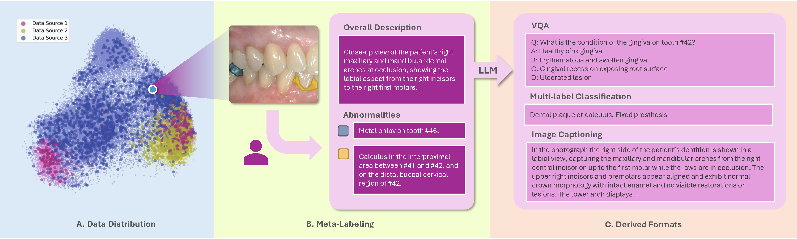

<h1 align="center">MetaDent: Labeling Clinical Images for Vision-Language Models in Dentistry</h1>

<p align="center">
  <!-- <a href="">
    
  </a> -->
  <a href="https://menxli.github.io/metadent/">
    
  </a>
  <a href="https://github.com/WenhDeng/metadent-bench">
    
  </a>
</p>

<p align="center">
  
</p>

**MetaDent Bench** is an open-source suite designed to evaluate Vision-Language Models (VLMs) in the context of intraoral photography.
It consists of three key components:

- **MetaDent Data** – A richly annotated dataset of **60,669** intraoral images, with a **semi-structured meta-labeling framework** that captures both high-level summaries and point-wise clinical descriptions. **Details of the dataset can be found in our [website](https://menxli.github.io/metadent/).**
- **Annotation & Generation Tools** – Open-source utilities for dataset curation, label management, and automatic benchmark data generation (VQA, Classification, Captioning).
- **Evaluation Framework** – A unified testing pipeline for VLM prediction and performance evaluation, covering VQA accuracy, multi-label classification metrics, and LLM-based caption evaluation.
---

## News

- **[2025-10-27]** Released our benchmark data generation pipeline and evaluation framework, along with the first 100 benchmark datasets for VQA, classification, and image captioning. 🔥🔥🔥
- **[2025-10-23]** Launched the [MetaDent Website](https://menxli.github.io/metadent/), featuring a demo of the annotation software and some image datasets. 🔥🔥🔥

---

## Installation
1. Create a conda environment and activate it:
    ```bash
    conda create -n metadent python=3.11 -y
    conda activate metadent
    ```
2. Clone the repository of metadent-bench and install requirements:
    ```bash
    git clone https://github.com/WenhDeng/metadent-bench
    cd metadent-bench
    pip install -r requirements.txt
    ```
3. Configure paths (`config.yaml`)
    ```bash
    data:
      image_dir: <your image dir>

    lfss:
      image_dir: <lfss image dir>
      meta_cn_dir: <lfss meta_cn dir>
      meta_en_dir: <lfss meta_en dir>

    local_models:
      baichuan-inc/Baichuan-Omni-1d5:
        model_dir: <model dir>

    api_models:
      openai/gpt-oss-120b:
        model_dir: <model dir>
        served_model_name: <served model name>
      
      AIDC-AI/Ovis2-34B:
        model_dir: <model dir>
        served_model_name: <served model name>
    ```
    > **NOTE 1 :**
    > `<lfss image dir>`, `<lfss meta_cn dir>` and `<lfss meta_en dir>` are the paths stored in **LFSS**. LFSS configuration can be found in the [MetaDent App](https://menxli.github.io/metadent-app/docs/).
    
    > **NOTE 2 :**
    > Currently, **local_models** only supports `baichuan-inc/Baichuan-Omni-1d5`.
    > Other local models can be deployed online via **vLLM**, and the corresponding deployment details should be entered under **api_models**. Models accessed through OpenAI, Gemini, or similar APIs do **not** need to be listed here.

4. If you want to use an external API for prediction, you need to configure the API’s base_url and key as environment variables, or pass them via command line arguments. In addition, **you must set up the LFSS environment variables**. You can add the following lines to your `~/metadent.sh` file:
    ```bash
    export LFSS_ENDPOINT=<your lfss endpoint>
    export LFSS_TOKEN=<your lfss token>
    export API_BASE_URL=<your api base url>
    export API_KEY=<your api key>
    ```
    Then, before each use, simply run:
    ```bash
    source ~/metadent.sh
    ```

## Usage
### Command-line Arguments

```bash
--task                  # 'generation', 'prediction', or 'evaluation'
--subtask               # 'vqa', 'classification', or 'captioning'
--model_name            # local path or API name (e.g., openai/gpt-oss-120b)
--client_type           # 'local' or 'api'
--api_base_url          # Base URL for OpenAI/vLLM-compatible API.
--api_key               # API key if using remote endpoint
--evaluator_model_name  # (Required for captioning evaluation)
```

### Example Commands
1. **Generate Benchmark Data**

    The first 100 benchmark samples have already been generated and can be directly accessed under the `data/` directory.

    If you wish to regenerate the benchmark data, use the following command:
    ```bash
    python -m src.main \
      --task generation \
      --subtask <subtask> \
      --client_type <client_type> \
      --model_name <model_name> \
      --api_base_url <api_base_url> \
      --api_key <api_key>
    ```
    The generated data are stored in: `data/vqa.json`, `data/classification.json`, and `data/captioning.json`.

    For more details, please refer to [QuickStart: Data Generation](docs/en/QuickStart_Data_Generation.md).

2. **Run VLM Predictions**

    Generate answers from the VLMs using only the image and the given prompt. This process also includes three subtasks: VQA, Classification, and Image Captioning. For detailed parameter settings, please refer to [QuickStart: Prediction](docs/en/QuickStart_Prediction.md)。
    ```bash
    python -m src.main \
      --task prediction \
      --subtask <subtask> \
      --client_type <client_type> \
      --model_name <model_name> \
    ```

    In the `prediction/` directory, the `results.json` file within each model’s folder contains the final results generated by the VLM.

3. **Evaluate Model Outputs**

    Evaluate the model outputs using the benchmark data. For detailed parameter settings, please refer to [QuickStart: Evaluation](docs/en/QuickStart_Evaluation.md)。
    ```bash
    python -m src.main \
      --task evaluation \
      --subtask <subtask> \
      --model_name <model_name>
    ```
    
    If you want to evaluate the captioning task, you need to specify the evaluator model name.
    ```bash
    python -m src.main \
      --task evaluation \
      --subtask <subtask> \
      --model_name <model_name> \
      --evaluator_model_name <evaluator_model_name>
    ```

    The final evaluation results for each model are stored under the `metric/` directory in the project root.
    Within each model’s folder, the `results.json` file contains the computed evaluation metrics.

## Evaluation Metrics

We assess VLMs across **three primary tasks**:

1. **Visual Question Answering (VQA)**
    - **Metric**: Accuracy (% correct answers)
    - **Modes**: Multiple-choice and True/False

2. **Multi-label Classification**
    - **Metrics**: Precision, Recall, F1-score, and Exact Match

3. **Image Captioning**
    - **Semantic Evaluation**: BERTScore between model caption and LLM-generated reference
    - **Diagnostic Consistency**: LLM-as-a-Judge verifying accuracy of anatomical and pathological findings

## Citation

<!-- If you find MetaDent useful for your research and applications, please cite using this BibTeX:
```bib

``` -->
